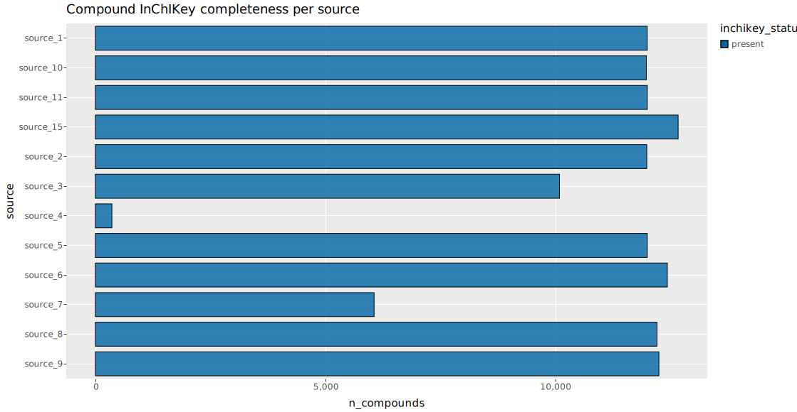
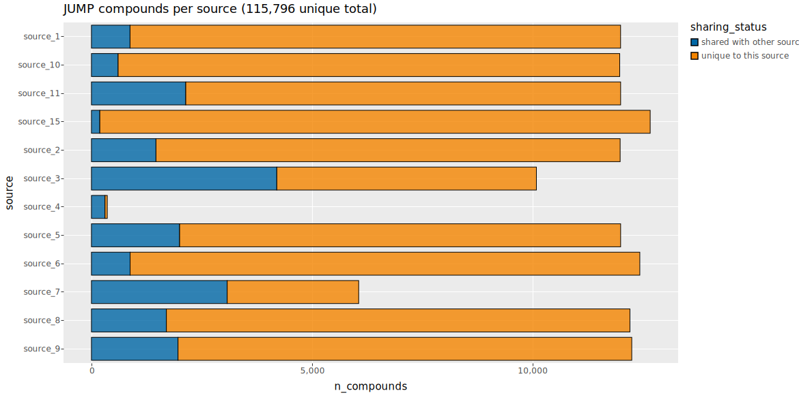
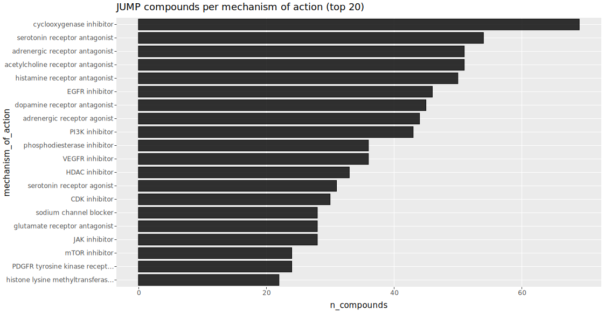

# jx queries

Catalog of self-contained ggsql queries against the canonical JUMP metadata DuckDB.
Each `q*.gsql` file answers one question; `just render` regenerates this page.

## Prerequisites

- [`ggsql`](https://ggsql.org/get_started/installation.html) — runs each `.gsql` file and emits a Vega-Lite spec.
- [`curl`](https://curl.se/) — used by `just setup` to download the prebuilt DuckDBs from the public S3 datastore.
- [`uv`](https://docs.astral.sh/uv/) — `just render` uses `uv run` to load `vl-convert-python` for SVG generation.

Run `just setup` once to download `data/jump_metadata.duckdb` (base) and `data/jump_metadata_augmented.duckdb` (adds `compound_metadata`: repurposing MOA, chemical-probe targets, compound properties), then `just render` to (re)generate this page and the `rendered/*.svg` thumbnails. A query targets the augmented DB with a `-- reader: duckdb://data/jump_metadata_augmented.duckdb` header. Both DuckDBs are built by the [`jump-cellpainting/datasets`](https://github.com/jump-cellpainting/datasets) / jump_production pipelines; `just build` rebuilds the base DB locally from a sibling `datasets` clone if you need it offline.

Each entry below shows the rendered SVG (click to enlarge) and the `.gsql` source. Vega-Lite JSON specs are regenerated by `just render` into `rendered/` (gitignored) — paste one into [vega.github.io/editor](https://vega.github.io/editor) to debug encoding.

## Plates per source by plate type

Composition of JUMP plates across the 13 data-generating sources, stacked by plate type.

Source: [`q01_plates_per_source.gsql`](q01_plates_per_source.gsql)

## Wells per source, faceted by plate type

Well-level breakdown joining well + plate, faceted by perturbation modality (COMPOUND, CRISPR, ORF, TARGET2). Shows which sources contributed which kinds of plates.

Source: [`q02_wells_per_source_faceted.gsql`](q02_wells_per_source_faceted.gsql)

## Perturbation counts by modality

Total perturbations in the JUMP catalog grouped by modality (compound, CRISPR, ORF, controls), pulled from the perturbation table.

Source: [`q03_perturbation_type_counts.gsql`](q03_perturbation_type_counts.gsql)

## Compound InChIKey completeness by source

For each compound source, how many compounds have a valid InChIKey vs are missing one (NULL, empty, 'NA', or wrong length). Every JUMP source currently resolves 100%.

Source: [`q04_compound_inchikey_completeness.gsql`](q04_compound_inchikey_completeness.gsql)

## Compound counts per source (shared vs unique)

JUMP catalogs 115,796 unique compounds across 12 sources. Each source's bar is split by whether the compound is unique to that source or also appears in at least one other source; source_3 and source_7 have the largest shared fractions.

Source: [`q05_compound_counts_per_source.gsql`](q05_compound_counts_per_source.gsql)

## Compounds per mechanism of action (top 20)

The 20 Drug Repurposing Hub mechanisms of action with the most JUMP compounds. Metadata_repurposing_moa is a pipe-delimited multilabel field, so it is unnested before counting distinct JCP2022 IDs per mechanism. Uses the augmented DB, which adds compound_metadata on top of the base tables.

Source: [`q06_compounds_per_moa.gsql`](q06_compounds_per_moa.gsql)
