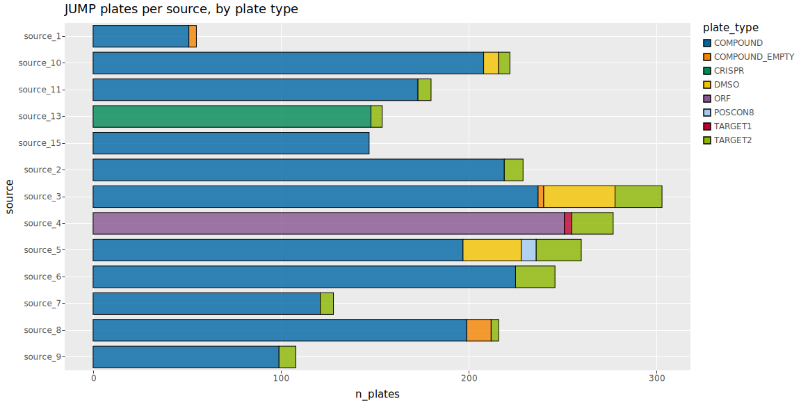
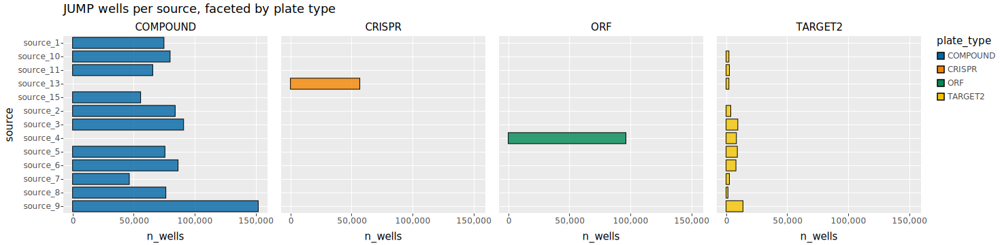
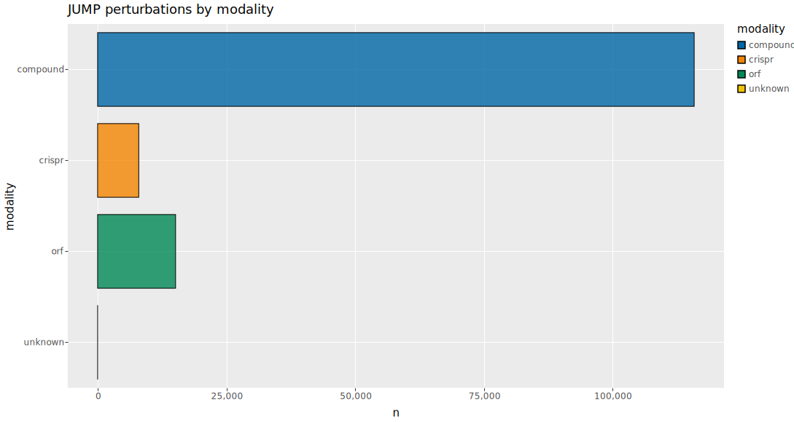

# jx queries

Catalog of self-contained ggsql queries against the canonical JUMP metadata DuckDB.
Each `q*.gsql` file answers one question; `just render` regenerates this page.

Each entry below shows the rendered SVG (click to enlarge), the `.gsql` source, and the raw Vega-Lite spec — paste the JSON into [vega.github.io/editor](https://vega.github.io/editor) to debug encoding.

## Plates per source by plate type

Composition of JUMP plates across the 13 data-generating sources, stacked by plate type.

Source: [`q01_plates_per_source.gsql`](q01_plates_per_source.gsql) · Spec: [`q01_plates_per_source.json`](rendered/q01_plates_per_source.json)

## Wells per source, faceted by plate type

Well-level breakdown joining well + plate, faceted by perturbation modality (COMPOUND, CRISPR, ORF, TARGET2). Shows which sources contributed which kinds of plates.

Source: [`q02_wells_per_source_faceted.gsql`](q02_wells_per_source_faceted.gsql) · Spec: [`q02_wells_per_source_faceted.json`](rendered/q02_wells_per_source_faceted.json)

## Perturbation counts by modality

Total perturbations in the JUMP catalog grouped by modality (compound, CRISPR, ORF, controls), pulled from the perturbation table.

Source: [`q03_perturbation_type_counts.gsql`](q03_perturbation_type_counts.gsql) · Spec: [`q03_perturbation_type_counts.json`](rendered/q03_perturbation_type_counts.json)
